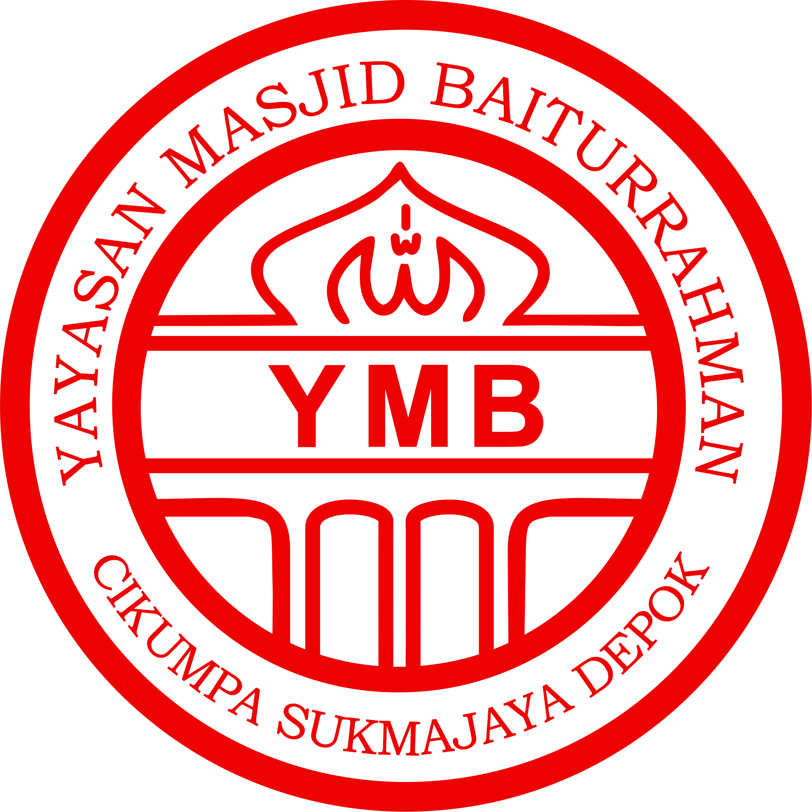

# 🕌 Sistem Informasi Masjid Merah Baiturrahman

<p align="center">
  
</p>

<p align="center">
  <strong>Sistem Manajemen Informasi Masjid Modern</strong><br>
  Transparansi • Profesional • Terpercaya
</p>

---

## 📖 Tentang Project

Sistem Informasi Masjid Merah Baiturrahman adalah aplikasi web berbasis Laravel yang dirancang untuk mengelola dan menampilkan informasi masjid secara transparan dan profesional. Sistem ini memfasilitasi pengelolaan organisasi, kegiatan, keuangan, dan aset masjid.

### 🎯 Tujuan
- ✅ Meningkatkan transparansi pengelolaan masjid
- ✅ Memudahkan akses informasi bagi jamaah
- ✅ Memprofesionalkan manajemen organisasi
- ✅ Mendokumentasikan kegiatan dan program kerja
- ✅ Mengelola keuangan secara transparan

### 🌟 Fitur Utama

#### 📱 Public Website
- **Profil Masjid**
  - Sejarah Masjid Merah
  - Visi & Misi
  - Struktur Kepengurusan

- **Manajemen Organisasi**
  - Kesekretariatan
  - Manajemen Bidang (5 bidang)
  - Target & Program Kerja

- **Transparansi**
  - Kegiatan Berjalan
  - Kegiatan Mendatang
  - Laporan Keuangan
  - Daftar Aset

#### 🔐 Admin Dashboard
- **Manajemen Organisasi**
  - Pengurus Inti
  - Anggota Bidang
  - Struktur Organisasi

- **Manajemen Kegiatan**
  - CRUD Kegiatan
  - Upload Foto Kegiatan
  - Manajemen Anggota Kegiatan

- **Keuangan**
  - Akun Keuangan
  - Transaksi Pemasukan/Pengeluaran
  - Laporan Keuangan

- **Aset**
  - Daftar Aset
  - Upload Foto Aset
  - Kategori Aset

- **Program Kerja**
  - Target Kesekretariatan
  - Target Program Bidang
  - Cakupan Bidang

---

## 🛠️ Technology Stack

- **Framework:** Laravel 12.46.0
- **PHP:** 8.2.12
- **Database:** MySQL
- **Frontend:** 
  - Bootstrap 5.3.0
  - Bootstrap Icons 1.11.0
  - Vanilla JavaScript
- **Server:** Apache (XAMPP)

---

## 📋 Persyaratan Sistem

- PHP >= 8.2
- MySQL >= 5.7
- Composer
- Node.js & NPM (untuk asset compilation)
- XAMPP (recommended) atau web server lain

---

## 🚀 Instalasi

### 1. Clone Repository
```bash
git clone [repository-url]
cd masjid-internal
```

### 2. Install Dependencies
```bash
composer install
npm install
```

### 3. Environment Setup
```bash
cp .env.example .env
php artisan key:generate
```

### 4. Database Configuration
Edit file `.env`:
```env
DB_CONNECTION=mysql
DB_HOST=127.0.0.1
DB_PORT=3306
DB_DATABASE=masjid_internal
DB_USERNAME=root
DB_PASSWORD=
```

### 5. Run Migrations
```bash
php artisan migrate --seed
```

### 6. Storage Link
```bash
php artisan storage:link
```

### 7. Create Required Directories
```bash
mkdir -p storage/app/public/kegiatan
mkdir -p storage/app/public/anggota
mkdir -p storage/app/public/aset
mkdir -p storage/app/public/struktur
mkdir -p storage/app/public/pengurus
```

### 8. Start Development Server
```bash
php artisan serve
```

Aplikasi akan berjalan di `http://127.0.0.1:8000`

---

## 👤 Default Login

**Admin Dashboard:**
- URL: `http://127.0.0.1:8000/login`
- Email: admin@masjid.com
- Password: password

---

## 📁 Struktur Project

```
masjid-internal/
├── app/
│   ├── Http/
│   │   └── Controllers/
│   │       ├── PublicController.php      # Public pages
│   │       ├── KegiatanController.php    # Kegiatan management
│   │       ├── AsetController.php        # Asset management
│   │       └── ...
│   └── Models/
│       ├── Kegiatan.php
│       ├── Bidang.php
│       ├── AnggotaBidang.php
│       └── ...
├── database/
│   └── migrations/                       # Database schema
├── public/
│   ├── images/                          # Static images
│   └── storage/                         # Symbolic link
├── resources/
│   └── views/
│       ├── public/                      # Public pages
│       ├── admin/                       # Admin dashboard
│       └── layouts/
├── routes/
│   └── web.php                          # Route definitions
└── storage/
    └── app/
        └── public/                      # User uploads
```

---

## 🎨 Struktur Database

### Tabel Utama
- `users` - Admin users
- `bidangs` - Organizational divisions
- `anggota_bidang` - Division members
- `pengurus_inti` - Core board members
- `kegiatan` - Events/activities
- `kegiatan_foto` - Event photos
- `aset` - Assets
- `akun_keuangan` - Financial accounts
- `transaksi_keuangan` - Financial transactions
- `target_kesekretariatan` - Secretariat targets
- `bidang_program_kerja` - Division work programs
- `target_program` - Program targets

---

## 🧪 Testing

### Run Deployment
```bash
deploy-revisi-phase3.bat
```

### Manual Testing
Lihat file `QUICK_TEST_GUIDE.md` untuk panduan testing cepat.

### Full Testing Checklist
Lihat file `TESTING_CHECKLIST_REVISI_PHASE3.md` untuk checklist lengkap.

---

## 📚 Dokumentasi

- **CHANGELOG.md** - History of changes
- **REVISI_PHASE3_COMPLETED.md** - Latest implementation details
- **SUMMARY_REVISI_PHASE3.md** - Executive summary
- **QUICK_TEST_GUIDE.md** - Quick testing guide
- **TESTING_CHECKLIST_REVISI_PHASE3.md** - Complete testing checklist

---

## 🔄 Development Workflow

### 1. Development
```bash
php artisan serve
```

### 2. Before Committing
```bash
php artisan cache:clear
php artisan view:clear
php artisan config:clear
```

### 3. Deployment
```bash
php artisan cache:clear
php artisan config:cache
php artisan route:cache
php artisan view:cache
```

---

## 🎯 Roadmap

### ✅ Completed (Phase 3)
- [x] Public website
- [x] Admin dashboard
- [x] Organizational management
- [x] Event management
- [x] Financial transparency
- [x] Asset management
- [x] Work program management

### 🔄 In Progress
- [ ] Performance optimization
- [ ] Image optimization
- [ ] Mobile app development

### 📋 Planned (Phase 4)
- [ ] Email notifications
- [ ] SMS reminders
- [ ] Online donation
- [ ] Mobile responsive improvements
- [ ] API development

---

## 🤝 Contributing

Contributions are welcome! Please follow these steps:

1. Fork the repository
2. Create a feature branch (`git checkout -b feature/AmazingFeature`)
3. Commit your changes (`git commit -m 'Add some AmazingFeature'`)
4. Push to the branch (`git push origin feature/AmazingFeature`)
5. Open a Pull Request

---

## 🐛 Bug Reports

Jika menemukan bug, silakan:
1. Check existing issues
2. Create detailed bug report
3. Include steps to reproduce
4. Attach screenshots if applicable

---

## 📞 Support

**Development Team:**
- Email: dev@masjid.com
- Phone: +62 812-3456-7890

**Documentation:**
- See `/docs` folder
- Check `QUICK_TEST_GUIDE.md` for common issues

---

## 📄 License

This project is proprietary software for Masjid Merah Baiturrahman.

---

## 🙏 Acknowledgments

- Laravel Framework
- Bootstrap Team
- Bootstrap Icons
- All contributors

---

## 📊 Project Status

| Aspect | Status |
|--------|--------|
| Development | ✅ Active |
| Testing | ✅ Complete |
| Documentation | ✅ Complete |
| Production Ready | ✅ Yes |

---

## 🔐 Security

- All user inputs are validated
- CSRF protection enabled
- SQL injection protection via Eloquent ORM
- File upload validation
- Session management

---

## ⚙️ Configuration

### Storage
```bash
# Link public storage
php artisan storage:link
```

### Cache
```bash
# Clear all cache
php artisan cache:clear
php artisan config:clear
php artisan view:clear
php artisan route:clear
```

### Optimization
```bash
# Optimize for production
php artisan config:cache
php artisan route:cache
php artisan view:cache
```

---

## 📱 Screenshots

### Public Website
- Homepage with hero section
- Organizational structure
- Event listings with images
- Financial transparency

### Admin Dashboard
- Clean, modern interface
- Easy-to-use forms
- Comprehensive management tools

---

## 🎨 Color Palette

```css
--primary: #A0293A   /* Maroon Red */
--secondary: #C5A572 /* Gold */
--accent: #FAF8F3    /* Cream */
--dark: #1e293b      /* Dark Blue */
```

---

## 📈 Version History

| Version | Date | Major Changes |
|---------|------|---------------|
| Phase 3 Rev 1 | 2026-01-22 | Bug fixes, UI improvements |
| Phase 3 | 2026-01-20 | Program Kerja features |
| Phase 2 | 2026-01-15 | Navigation restructure |
| Phase 1 | 2026-01-10 | Initial release |

---

## 🔗 Quick Links

- [Changelog](CHANGELOG.md)
- [Testing Guide](QUICK_TEST_GUIDE.md)
- [Implementation Docs](REVISI_PHASE3_COMPLETED.md)
- [Summary Report](SUMMARY_REVISI_PHASE3.md)

---

**Built with ❤️ for Masjid Merah Baiturrahman**

**Last Updated:** 22 Januari 2026  
**Version:** Phase 3 - Revision 1  
**Status:** Production Ready ✅
